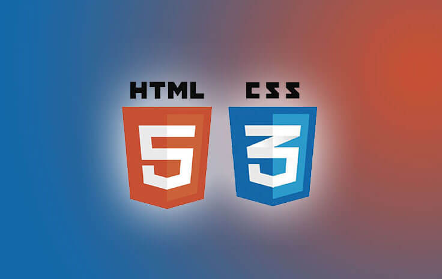

# heardwang.github.io 个人博客 (Personal blog)
<h3>V1.0</h3> 
2016/9/22 
个人站点框架初步告成，每天积累一点点，记录工作中的点点滴滴。 
主题框架沿用百度UE风格，文章格式借鉴helloweb风格，后院借鉴W3CFUNS风格 
<strong>博客声明：</strong>本资料均源自互联网，仅作为学习参考实例，不用于商业用途，本人不承担任何法律责任，分享与创新开发，积累前端技能点点滴滴，为保护原作则版权，转载请注明原作者地址，如有其它疑问请联系我（MailTo：knight20999@sina.com）。 
<h3>V2.0</h3> 
2016/9/28 
 

前院后院整合完成，整体结构完成，基本机构表现、动态效果整合完成。
 

首页小图尺寸：220*138
 
<i>更新：更新文章页，更新文章图片文件夹，更新json列表，更新demo以及其他素材</i> 
<h3>文章格式</h3>
&lt;h3>&lt;/h3> 
&lt;pre class="brush:js;">&lt;/pre> 
&lt;p>知识点:&lt;/p> 
&lt;ul class="code-list"> 
&lt;li>&lt;/li> 
&lt;li>&lt;/li> 
&lt;li>&lt;/li> 
&lt;/ul> 
&lt;p>&lt;/p> 
 
&lt;div class="i-photo">&lt;img src="images/article_07/3.png" alt="" title="WebWang-前端网"/>&lt;/div> 
&lt;div class="preface">&lt;/div> 
<h3>V2.1</h3> 
2016/9/29 
处理了移动端适配，增加了媒体查询，基本兼容iphone5-6P，资源页移动端打开仍会有问题。
